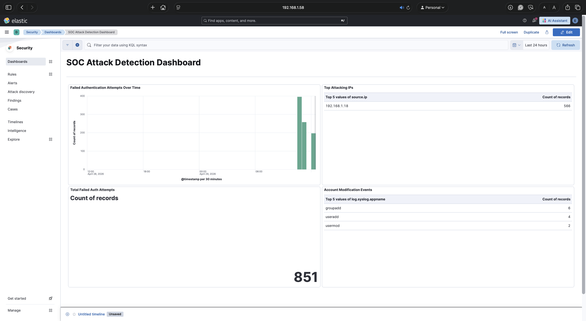

# SOC Home Lab — ELK Stack Attack Detection

A home security operations lab built to simulate real-world attack scenarios and practice threat detection using the Elastic Stack. The lab runs on an Apple M4 Mac Mini using UTM virtualization with two ARM64 virtual machines.

## Lab Architecture

| Component | Details |
|---|---|
| Host | Apple Mac Mini M4, 32GB RAM |
| SIEM | Ubuntu 26.04 ARM64 — Elasticsearch, Kibana, Elastic Agent |
| Attacker | Kali Linux 2023 ARM64 |
| Network | Bridged (192.168.1.0/24) |

## What Was Built

- Full ELK stack deployed on ARM64 Ubuntu — Elasticsearch, Kibana, Elastic Agent
- Custom Kibana dashboard tracking failed auth attempts, top attacking IPs, and account modification events
- Two custom detection rules written from scratch
- 1,618 Elastic prebuilt detection rules installed and enabled
- All attack activity logged, alerted on, and investigated end to end

## Attacks Simulated

| Attack | Tool | MITRE Technique |
|---|---|---|
| Network reconnaissance | Nmap | T1046 |
| SSH brute force | Hydra | T1110 |
| System discovery | Manual | T1033, T1087, T1057 |
| Backdoor account creation | Manual | T1136 |
| Privilege escalation | Manual | T1078 |

## Detection Rules Created

**SSH Brute Force Detection**
- Type: Threshold
- Query: `event.dataset : "system.auth" and event.outcome : "failure"`
- Fires when a single IP generates 5+ failed SSH logins within 5 minutes
- Severity: Medium

**Suspicious Account Creation or Modification**
- Type: Threshold  
- Query: `event.dataset : "system.auth" and log.syslog.appname : "useradd" or "usermod"`
- Fires on any account creation or modification event
- Severity: High

## Results

- 851 failed authentication attempts captured
- 21 alerts fired across 3 detection rules
- Backdoor account creation detected within seconds of execution
- All 6 MITRE ATT&CK techniques successfully logged and alerted

## Dashboard

## Alerts

## Full Report

See [soc_lab_report.docx](soc_lab_report.docx) for the complete write-up including forensic evidence, MITRE ATT&CK mapping, and recommendations.

## Tools Used

- Elastic Stack 8.19.14 (Elasticsearch, Kibana, Elastic Agent, Filebeat)
- Kali Linux 2023
- Nmap
- Hydra
- UTM (Apple Silicon virtualization)
- Ubuntu 26.04 ARM64
