

# 🛡️ SOC / SIEM Detection Lab
### Multi-Host Attack Detection with the Elastic Stack + Sysmon

  
  
  

<!-- Highlights / KPI row -->

  
  
  
  

<!-- Tech row -->

  
  
  
  
  
  

<!-- Nav -->

  <a href="#architecture"><b>Architecture</b></a> &nbsp;·&nbsp;
  <a href="#detects"><b>Detections</b></a> &nbsp;·&nbsp;
  <a href="#deep-dive"><b>Deep Dive</b></a> &nbsp;·&nbsp;
  <a href="#triage"><b>Triage</b></a> &nbsp;·&nbsp;
  <a href="#threatintel"><b>Threat Intel</b></a> &nbsp;·&nbsp;
  <a href="#roadmap"><b>Roadmap</b></a>

A home Security Operations lab that simulates a full multi-stage attack against a
Windows endpoint and detects each stage with custom-built Elastic detection rules,
mapped to MITRE ATT&CK. Rebuilt in 2026 from a single-box ELK setup into a
multi-host SOC with Fleet-managed agents and Sysmon EDR-style telemetry.

> **Status: actively developed.** See the [Roadmap](#roadmap) for what is live and what is in progress.

---

## 🖥️ Lab Architecture

A 3-node design that mirrors a real SOC: a SIEM, a monitored endpoint, and an attacker.

| Node | Role | Details |
|---|---|---|
| **soc-siem** | SIEM + management | Ubuntu 26.04 (ARM64) running Elasticsearch, Kibana, and **Fleet Server**. LAN-bound at `192.168.1.56` |
| **DC01** | Monitored endpoint (victim) | Windows Server 2022 (x64) running Elastic Agent + **Sysmon** (SwiftOnSecurity config) |
| **attacker** | Attacker | Ubuntu (ARM64) running Impacket and offensive tooling |

**Hosts:** Apple Mac Mini M4 (UTM) for the SIEM and the attacker box; a separate Windows laptop
(Oracle VirtualBox) for DC01. &nbsp;**Network:** bridged, `192.168.1.0/24`.
**Log sources shipped to Elastic:** Sysmon/Operational, Windows Security, Windows
System, PowerShell/Operational, and Linux `system.auth`.

---

## 🎯 What This Lab Detects

Seven custom detection rules covering a realistic intrusion end to end, across **six ATT&CK tactics**:

| # | Detection Rule | Tactic | Technique (ID) | Log Source | Severity |
|:-:|---|---|---|---|:-:|
| 1 | Office App Spawning Command/Script Interpreter | Initial Access / Execution | Phishing, PowerShell (T1566, T1204.002, T1059.001) | Sysmon EID 1 | High |
| 2 | Registry Run Key Persistence | Persistence | Registry Run Keys (T1547.001) | Sysmon EID 13 | Medium |
| 3 | New Windows Service Installed | Persistence | Windows Service (T1543.003) | Windows EID 7045 | High |
| 4 | Scheduled Task Created via schtasks.exe | Persistence | Scheduled Task (T1053.005) | Sysmon EID 1 | Medium |
| 5 | Credential Dumping: LSASS Memory Access | Credential Access | LSASS Memory (T1003.001) | Sysmon EID 10 | **Critical** |
| 6 | Windows Security Event Log Cleared | Defense Evasion | Clear Windows Event Logs (T1070.001) | Windows EID 1102 | High |
| 7 | Lateral Movement via WMI | Lateral Movement / Execution | Remote Services, WMI (T1021, T1047) | Sysmon EID 1 | High |

> 📄 Full mapping and tactic-coverage table: **[MITRE-ATTACK-MAPPING.md](MITRE-ATTACK-MAPPING.md)**

  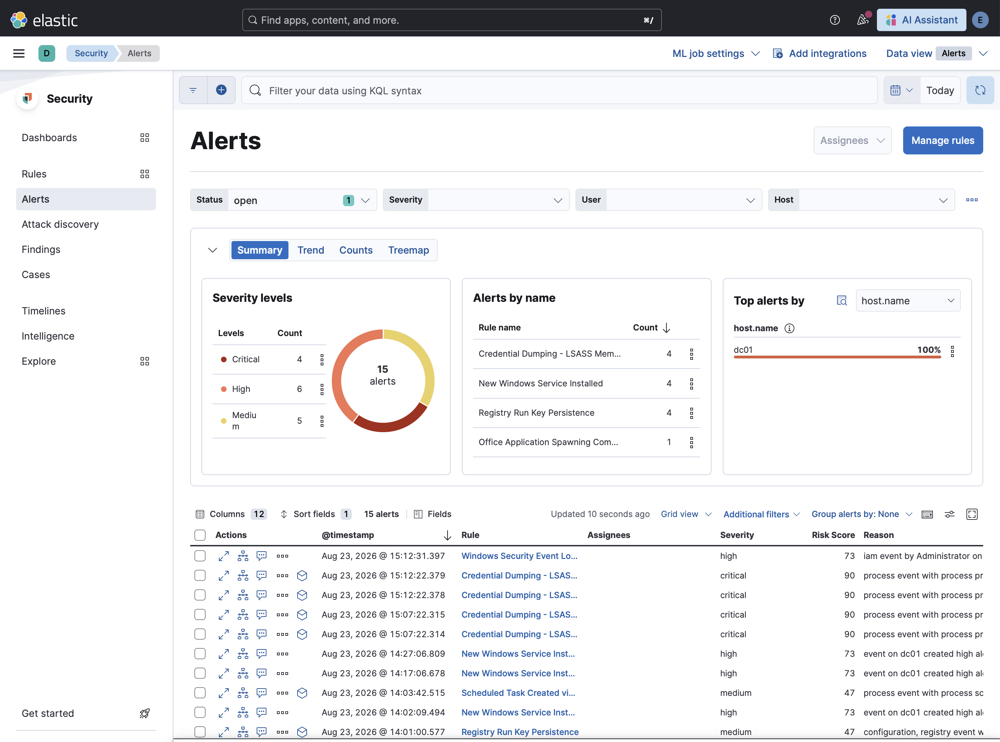
   
  <i>The attack chain caught end to end: alerts by severity, by rule, and by host (100% on DC01).</i>

---

## 🔬 Detections In Depth

### 1 · Phishing to Execution &nbsp;`T1566` `T1204.002` `T1059.001`
Detects a Microsoft Office process spawning a shell or script interpreter, the
classic malicious-macro-to-execution fingerprint. Office does not launch
PowerShell in normal use, so this parent/child relationship is high signal.

  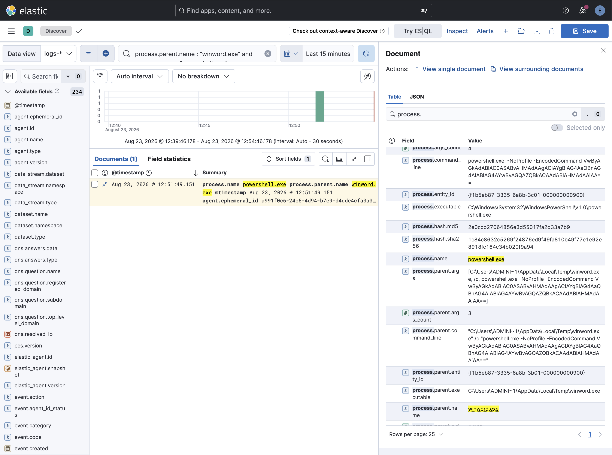
   
  <i>Sysmon EID 1: winword.exe spawning powershell.exe with an encoded command line.</i>
    
  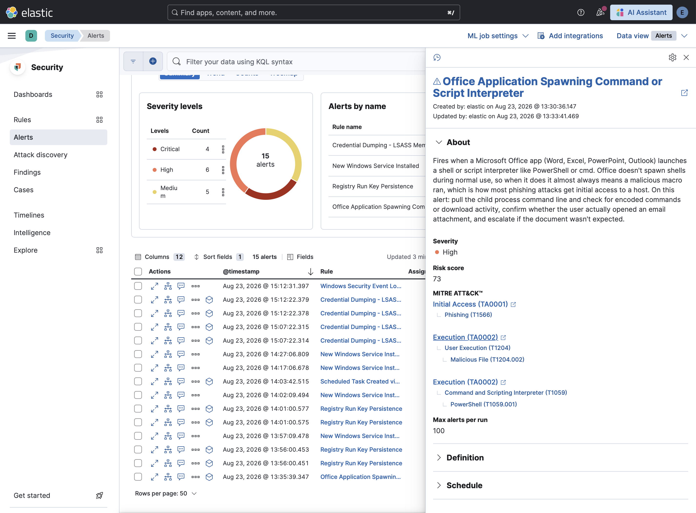

### 2 to 4 · Persistence &nbsp;`T1547.001` `T1543.003` `T1053.005`
Detects the three classic auto-start persistence mechanisms: a registry Run key,
a new Windows service, and a scheduled task.

  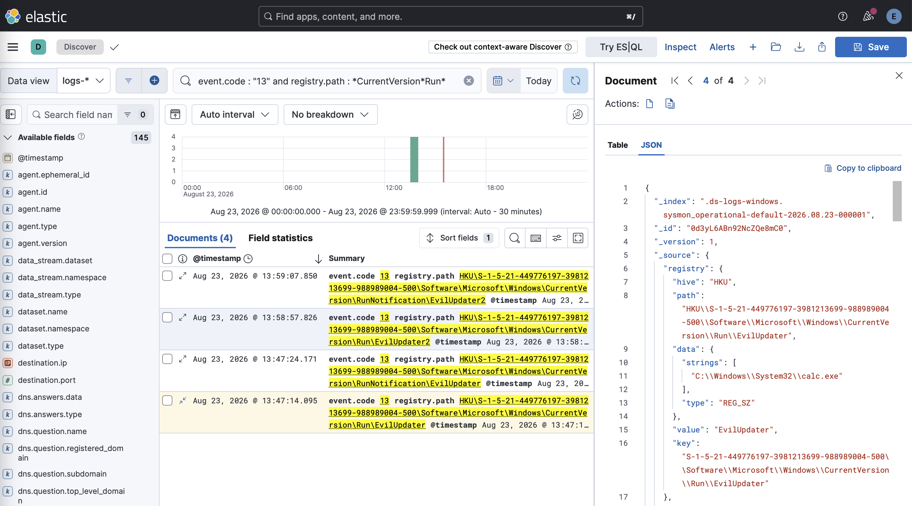
   
  <i>Sysmon EID 13: a new CurrentVersion\Run\EvilUpdater value.</i>

### 5 · Credential Dumping (LSASS) &nbsp;`T1003.001`
The highest-severity detection in the lab. Detects a process opening lsass.exe
with high-privilege memory-read access rights (0x1fffff and related masks) used
to dump credentials, while filtering out the roughly 93% background noise of
benign 0x1000 and 0x1400 reads from the agent and system processes.

> 💡 **Detection-engineering highlight:** the SwiftOnSecurity Sysmon config shipped
> with an **empty** ProcessAccess (EID 10) section, so lsass access was invisible.
> This was found during testing, the Sysmon config was tuned to log lsass access,
> and the detection was then built on access-mask analysis. Finding and closing a
> sensor visibility gap is core detection-engineering work.

  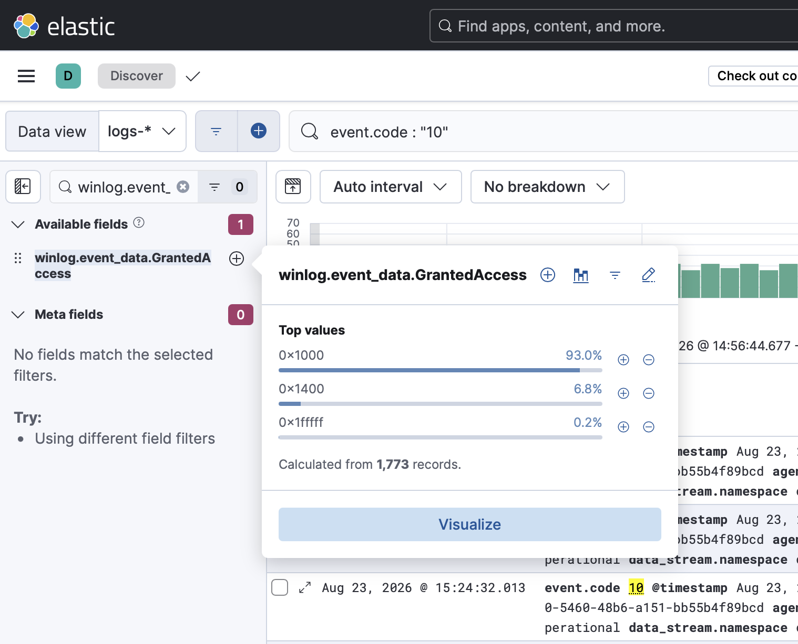
   
  <i>Access-rights distribution: 93% benign 0x1000 vs 0.2% 0x1fffff, the dump is the outlier.</i>
    
  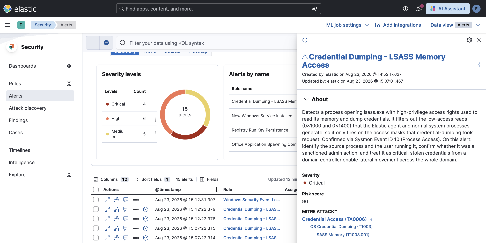

### 6 · Defense Evasion, Log Clearing &nbsp;`T1070.001`
Detects clearing of the Windows Security event log (Event ID 1102), a classic
"cover the tracks" move that almost never happens legitimately on a server.

  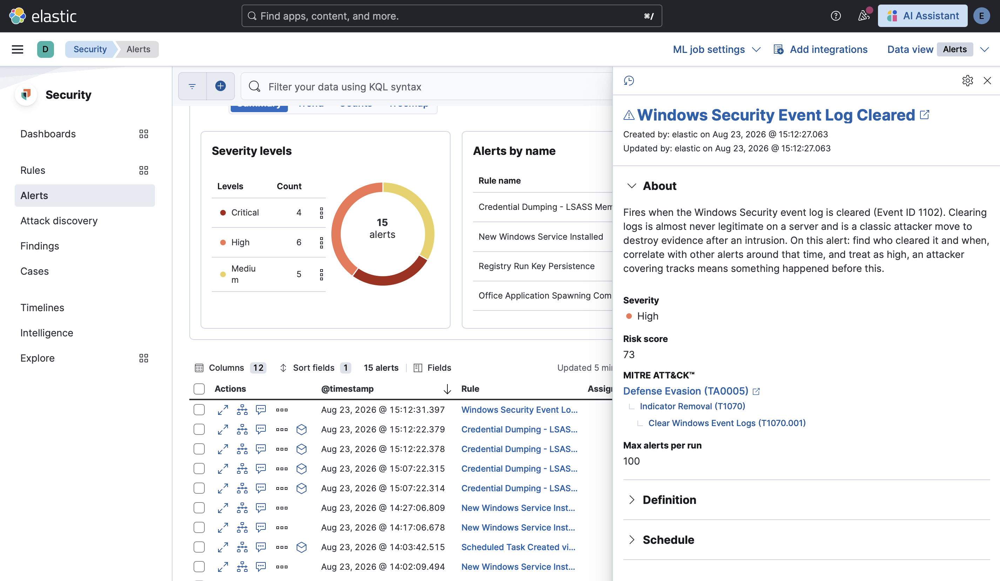

### 7 · Lateral Movement via WMI &nbsp;`T1021` `T1047`
After stealing credentials, an attacker reuses them to reach other machines over
built-in remote protocols. Simulated with Impacket wmiexec from a separate attacker
host to DC01, which produces a network logon (Event 4624, Type 3) and remote command
execution via the WMI provider host (WmiPrvSE.exe spawning cmd.exe). The detection
keys on the WmiPrvSE-to-cmd relationship, which legitimate software almost never
produces.

  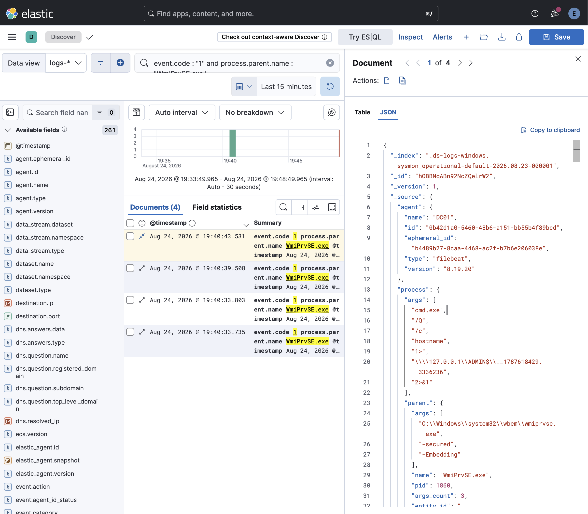
   
  <i>Sysmon EID 1: WmiPrvSE.exe spawning cmd.exe, output redirected to the ADMIN$ share (the wmiexec signature).</i>
    
  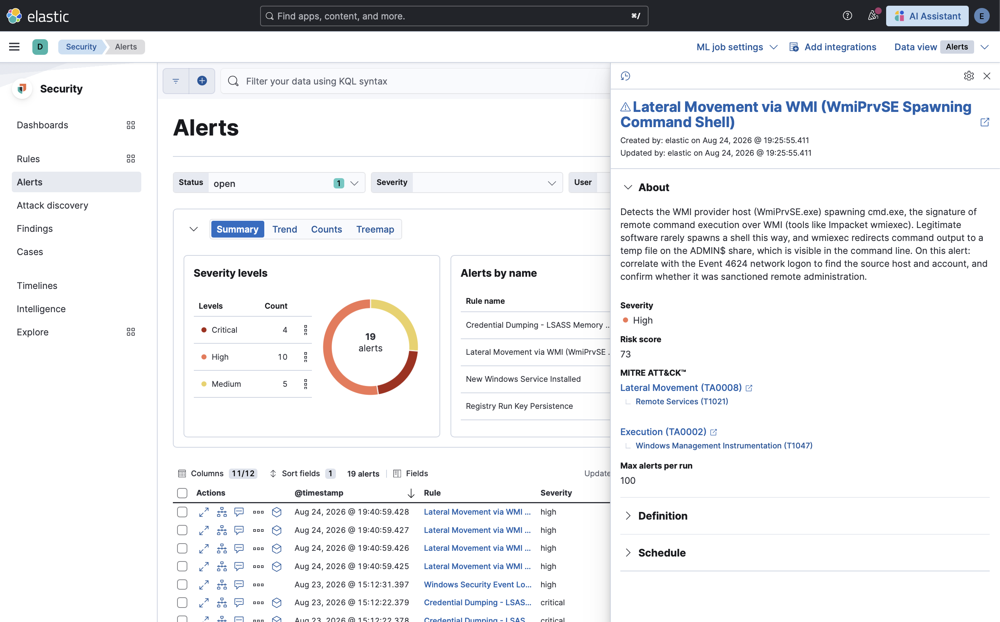

---

## 🧪 Attack Chain Simulated

All attacker actions were run from the Ubuntu attacker box or on DC01 in the isolated lab,
using benign payloads (calc.exe) that produce the same telemetry as real malware:

`Phishing macro` → `PowerShell execution` → `Persistence` → `LSASS credential dump` → `Lateral movement` → `Log cleared`

Each stage generated live telemetry, fired the matching custom rule, and was
verified in Kibana Discover before the rule was built.

---

## 🔎 Analyst Triage Investigations

Alert-triage writeups documenting the L1 analyst workflow (alert, triage questions,
investigation, verdict, action) for four alerts from this lab:

| # | Investigation | Severity | Verdict |
|:-:|---|:-:|---|
| 01 | [Credential Dumping (LSASS)](triage/triage-01-lsass-credential-dumping.md) | Critical | True Positive |
| 02 | [Office Spawning PowerShell](triage/triage-02-phishing-execution.md) | High | True Positive |
| 03 | [Benign LSASS Access](triage/triage-03-lsass-false-positive.md) | Critical | False Positive (rule tuned) |
| 04 | [LSASS Surge from Sysmon](triage/triage-04-lsass-sysmon-false-positive.md) | Critical | False Positive (rule tuned) |

Reports 03 and 04 show the full false-positive workflow: investigating benign
telemetry, confirming it cannot dump credentials, and tuning the rule from two
different angles (by access mask, then by source) while preserving detection of a
real dump.

---

## 🧠 Threat Intelligence Enrichment

Enrichment is the analyst-desk skill of taking an artifact from an alert (a file
hash, an IP, a domain) and looking it up against public intelligence to answer one
question: is this known-bad, and what does it do? Every step here is a **read-only
hash lookup**. No malware was executed.

Two contrasting file hashes were enriched to show what hash reputation can and cannot
tell you:

| Sample | VirusTotal | Reading |
|---|:-:|---|
| `procdump64.exe` (from the LSASS detection) | **0 / 71** | Clean. A signed Microsoft tool used maliciously. Hash reputation is **blind** to it. |
| Fresh infostealer (first seen same day) | **5 / 74** | Confirmed-bad by 5 sandboxes, but hours old, so hash reputation is **slow** to catch up. |

The takeaway drives the whole lab: hash reputation is a **lagging indicator**, blind
to living-off-the-land tools and slow on fresh threats. That is the case for detecting
on **behavior** (the `0x1fffff` LSASS mask, encoded-command chains, service installs)
rather than on hashes alone.

> 📄 Full IOC writeup, ATT&CK mapping of the sample's behaviors, and sources: **[THREAT-INTEL-ENRICHMENT.md](THREAT-INTEL-ENRICHMENT.md)**

  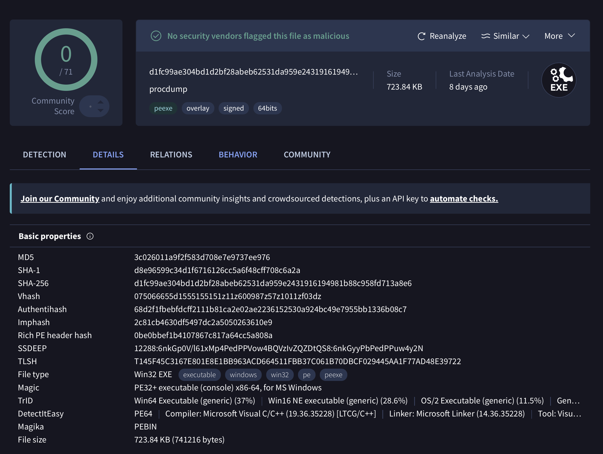
  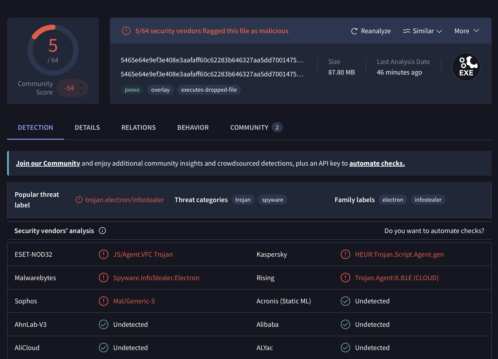
   
  <i>Left: a legitimate tool used to dump LSASS, clean at 0/71. Right: a confirmed infostealer first seen the same day, only 5/74 because signatures lag.</i>

---

## 🐧 Linux / Auth Detections (Foundation)

The original build of this lab focused on Linux authentication attacks against the
Ubuntu SIEM host, and those detections remain part of the lab (the host still ships
`system.auth` to Elasticsearch).

**Simulated from the Ubuntu attacker:** network recon (Nmap, T1046), SSH brute force (Hydra, T1110),
system/user discovery (T1033, T1087, T1057), backdoor account creation (T1136), and
privilege escalation (T1078).

| Detection Rule | Type | Tactic | Technique (ID) |
|---|---|---|---|
| SSH Brute Force | Threshold | Credential Access | Brute Force (T1110) |
| Suspicious Account Creation/Modification | Threshold | Persistence | Create Account (T1136) |

**Results:** 851 failed-authentication events captured, backdoor account creation
detected within seconds, all mapped to MITRE ATT&CK.

  
   
  <i>Custom Kibana dashboard: failed auth attempts, top attacking IPs, and account-modification events.</i>
    
  
   
  <i>Custom and prebuilt rules firing in Kibana: 21 alerts across the simulated attack chain.</i>

---

## 🗺️ Roadmap

This lab is under active development. Completed and planned work:

**Done**
- [x] Multi-host SIEM rebuild: Elasticsearch + Kibana + Fleet (LAN-bound)
- [x] Windows endpoint (DC01) enrolled via Fleet with Sysmon
- [x] Sysmon config tuning to close an EID 10 (ProcessAccess) visibility gap
- [x] 7 custom detections across 6 ATT&CK tactics
- [x] MITRE ATT&CK coverage mapping
- [x] Analyst alert-triage investigation writeups (4 reports: 2 true positive, 2 false positive)
- [x] Lateral movement detection via WMI (T1021 / T1047)
- [x] Threat-intel IOC enrichment (VirusTotal): dual-use vs fresh-malware contrast

**In progress / planned**
- [ ] SOC KPI dashboard: alert volume, detections by tactic, detection latency (MTTD)
- [ ] Correlation rule + SOAR-lite automation

---

## 🧰 Tools & Stack

Elastic Stack 8.19 (Elasticsearch, Kibana, Fleet, Elastic Agent), Sysmon
(SwiftOnSecurity config), Windows Server 2022, Ubuntu (attacker), UTM and Oracle
VirtualBox virtualization, MITRE ATT&CK.

<i>AI (Claude, Anthropic) was used as a learning and documentation aid. All detections were designed, built, tested, and validated by me.</i>

---

## 📚 Other Labs in This Series

| Lab | Topic | Repo |
|:-:|---|---|
| **Lab 1** | **SOC/SIEM Detection** | **This repo** |
| Lab 2 | Incident Response Simulation | [incident-response-lab](https://github.com/jsmith-sec/incident-response-lab) |
| Lab 3 | Web Application Attack | [web-app-attack-lab](https://github.com/jsmith-sec/web-app-attack-lab) |
| Lab 4 | Vulnerability Assessment | [vulnerability-assessment-lab](https://github.com/jsmith-sec/vulnerability-assessment-lab) |
| Lab 5 | Malware Analysis | [malware-analysis-lab](https://github.com/jsmith-sec/malware-analysis-lab) |
| Lab 6 | Phishing Analysis | [phishing-analysis-lab](https://github.com/jsmith-sec/phishing-analysis-lab) |
| Lab 7 | Active Directory Attack | [active-directory-lab](https://github.com/jsmith-sec/active-directory-lab) |
**Hosts:** Apple Mac Mini M4 (UTM) for the SIEM and the attacker box; a separate Windows laptop
(Oracle VirtualBox) for DC01. &nbsp;**Network:** bridged, `192.168.1.0/24`.
**Log sources shipped to Elastic:** Sysmon/Operational, Windows Security, Windows
System, PowerShell/Operational, and Linux `system.auth`.

---

## 🎯 What This Lab Detects

Seven custom detection rules covering a realistic intrusion end to end, across **six ATT&CK tactics**:

| # | Detection Rule | Tactic | Technique (ID) | Log Source | Severity |
|:-:|---|---|---|---|:-:|
| 1 | Office App Spawning Command/Script Interpreter | Initial Access / Execution | Phishing, PowerShell (T1566, T1204.002, T1059.001) | Sysmon EID 1 | High |
| 2 | Registry Run Key Persistence | Persistence | Registry Run Keys (T1547.001) | Sysmon EID 13 | Medium |
| 3 | New Windows Service Installed | Persistence | Windows Service (T1543.003) | Windows EID 7045 | High |
| 4 | Scheduled Task Created via schtasks.exe | Persistence | Scheduled Task (T1053.005) | Sysmon EID 1 | Medium |
| 5 | Credential Dumping: LSASS Memory Access | Credential Access | LSASS Memory (T1003.001) | Sysmon EID 10 | **Critical** |
| 6 | Windows Security Event Log Cleared | Defense Evasion | Clear Windows Event Logs (T1070.001) | Windows EID 1102 | High |
| 7 | Lateral Movement via WMI | Lateral Movement / Execution | Remote Services, WMI (T1021, T1047) | Sysmon EID 1 | High |

> 📄 Full mapping and tactic-coverage table: **[MITRE-ATTACK-MAPPING.md](MITRE-ATTACK-MAPPING.md)**

  
   
  <i>The attack chain caught end to end: alerts by severity, by rule, and by host (100% on DC01).</i>

---

## 🔬 Detections In Depth

### 1 · Phishing to Execution &nbsp;`T1566` `T1204.002` `T1059.001`
Detects a Microsoft Office process spawning a shell or script interpreter, the
classic malicious-macro-to-execution fingerprint. Office does not launch
PowerShell in normal use, so this parent/child relationship is high signal.

  
   
  <i>Sysmon EID 1: winword.exe spawning powershell.exe with an encoded command line.</i>
    
  

### 2 to 4 · Persistence &nbsp;`T1547.001` `T1543.003` `T1053.005`
Detects the three classic auto-start persistence mechanisms: a registry Run key,
a new Windows service, and a scheduled task.

  
   
  <i>Sysmon EID 13: a new CurrentVersion\Run\EvilUpdater value.</i>

### 5 · Credential Dumping (LSASS) &nbsp;`T1003.001`
The highest-severity detection in the lab. Detects a process opening lsass.exe
with high-privilege memory-read access rights (0x1fffff and related masks) used
to dump credentials, while filtering out the roughly 93% background noise of
benign 0x1000 and 0x1400 reads from the agent and system processes.

> 💡 **Detection-engineering highlight:** the SwiftOnSecurity Sysmon config shipped
> with an **empty** ProcessAccess (EID 10) section, so lsass access was invisible.
> This was found during testing, the Sysmon config was tuned to log lsass access,
> and the detection was then built on access-mask analysis. Finding and closing a
> sensor visibility gap is core detection-engineering work.

  
   
  <i>Access-rights distribution: 93% benign 0x1000 vs 0.2% 0x1fffff, the dump is the outlier.</i>
    
  

### 6 · Defense Evasion, Log Clearing &nbsp;`T1070.001`
Detects clearing of the Windows Security event log (Event ID 1102), a classic
"cover the tracks" move that almost never happens legitimately on a server.

  

### 7 · Lateral Movement via WMI &nbsp;`T1021` `T1047`
After stealing credentials, an attacker reuses them to reach other machines over
built-in remote protocols. Simulated with Impacket wmiexec from a separate attacker
host to DC01, which produces a network logon (Event 4624, Type 3) and remote command
execution via the WMI provider host (WmiPrvSE.exe spawning cmd.exe). The detection
keys on the WmiPrvSE-to-cmd relationship, which legitimate software almost never
produces.

  
   
  <i>Sysmon EID 1: WmiPrvSE.exe spawning cmd.exe, output redirected to the ADMIN$ share (the wmiexec signature).</i>
    
  

---

## 🧪 Attack Chain Simulated

All attacker actions were run from the Ubuntu attacker box or on DC01 in the isolated lab,
using benign payloads (calc.exe) that produce the same telemetry as real malware:

`Phishing macro` → `PowerShell execution` → `Persistence` → `LSASS credential dump` → `Lateral movement` → `Log cleared`

Each stage generated live telemetry, fired the matching custom rule, and was
verified in Kibana Discover before the rule was built.

---

## 🔎 Analyst Triage Investigations

Alert-triage writeups documenting the L1 analyst workflow (alert, triage questions,
investigation, verdict, action) for four alerts from this lab:

| # | Investigation | Severity | Verdict |
|:-:|---|:-:|---|
| 01 | [Credential Dumping (LSASS)](triage/triage-01-lsass-credential-dumping.md) | Critical | True Positive |
| 02 | [Office Spawning PowerShell](triage/triage-02-phishing-execution.md) | High | True Positive |
| 03 | [Benign LSASS Access](triage/triage-03-lsass-false-positive.md) | Critical | False Positive (rule tuned) |
| 04 | [LSASS Surge from Sysmon](triage/triage-04-lsass-sysmon-false-positive.md) | Critical | False Positive (rule tuned) |

Reports 03 and 04 show the full false-positive workflow: investigating benign
telemetry, confirming it cannot dump credentials, and tuning the rule from two
different angles (by access mask, then by source) while preserving detection of a
real dump.

---

## 🧠 Threat Intelligence Enrichment

Enrichment is the analyst-desk skill of taking an artifact from an alert (a file
hash, an IP, a domain) and looking it up against public intelligence to answer one
question: is this known-bad, and what does it do? Every step here is a **read-only
hash lookup**. No malware was executed.

Two contrasting file hashes were enriched to show what hash reputation can and cannot
tell you:

| Sample | VirusTotal | Reading |
|---|:-:|---|
| `procdump64.exe` (from the LSASS detection) | **0 / 71** | Clean. A signed Microsoft tool used maliciously. Hash reputation is **blind** to it. |
| Fresh infostealer (first seen same day) | **5 / 74** | Confirmed-bad by 5 sandboxes, but hours old, so hash reputation is **slow** to catch up. |

The takeaway drives the whole lab: hash reputation is a **lagging indicator**, blind
to living-off-the-land tools and slow on fresh threats. That is the case for detecting
on **behavior** (the `0x1fffff` LSASS mask, encoded-command chains, service installs)
rather than on hashes alone.

> 📄 Full IOC writeup, ATT&CK mapping of the sample's behaviors, and sources: **[THREAT-INTEL-ENRICHMENT.md](THREAT-INTEL-ENRICHMENT.md)**

  
  
   
  <i>Left: a legitimate tool used to dump LSASS, clean at 0/71. Right: a confirmed infostealer first seen the same day, only 5/74 because signatures lag.</i>

---

## 🐧 Linux / Auth Detections (Foundation)

The original build of this lab focused on Linux authentication attacks against the
Ubuntu SIEM host, and those detections remain part of the lab (the host still ships
`system.auth` to Elasticsearch).

**Simulated from the Ubuntu attacker:** network recon (Nmap, T1046), SSH brute force (Hydra, T1110),
system/user discovery (T1033, T1087, T1057), backdoor account creation (T1136), and
privilege escalation (T1078).

| Detection Rule | Type | Tactic | Technique (ID) |
|---|---|---|---|
| SSH Brute Force | Threshold | Credential Access | Brute Force (T1110) |
| Suspicious Account Creation/Modification | Threshold | Persistence | Create Account (T1136) |

**Results:** 851 failed-authentication events captured, backdoor account creation
detected within seconds, all mapped to MITRE ATT&CK.

  
   
  <i>Custom Kibana dashboard: failed auth attempts, top attacking IPs, and account-modification events.</i>
    
  
   
  <i>Custom and prebuilt rules firing in Kibana: 21 alerts across the simulated attack chain.</i>

---

## 🗺️ Roadmap

This lab is under active development. Completed and planned work:

**Done**
- [x] Multi-host SIEM rebuild: Elasticsearch + Kibana + Fleet (LAN-bound)
- [x] Windows endpoint (DC01) enrolled via Fleet with Sysmon
- [x] Sysmon config tuning to close an EID 10 (ProcessAccess) visibility gap
- [x] 7 custom detections across 6 ATT&CK tactics
- [x] MITRE ATT&CK coverage mapping
- [x] Analyst alert-triage investigation writeups (4 reports: 2 true positive, 2 false positive)
- [x] Lateral movement detection via WMI (T1021 / T1047)
- [x] Threat-intel IOC enrichment (VirusTotal): dual-use vs fresh-malware contrast

**In progress / planned**
- [ ] SOC KPI dashboard: alert volume, detections by tactic, detection latency (MTTD)
- [ ] Correlation rule + SOAR-lite automation

---

## 🧰 Tools & Stack

Elastic Stack 8.19 (Elasticsearch, Kibana, Fleet, Elastic Agent), Sysmon
(SwiftOnSecurity config), Windows Server 2022, Ubuntu (attacker), UTM and Oracle
VirtualBox virtualization, MITRE ATT&CK.

<i>AI (Claude, Anthropic) was used as a learning and documentation aid. All detections were designed, built, tested, and validated by me.</i>

---

## 📚 Other Labs in This Series

| Lab | Topic | Repo |
|:-:|---|---|
| **Lab 1** | **SOC/SIEM Detection** | **This repo** |
| Lab 2 | Incident Response Simulation | [incident-response-lab](https://github.com/jsmith-sec/incident-response-lab) |
| Lab 3 | Web Application Attack | [web-app-attack-lab](https://github.com/jsmith-sec/web-app-attack-lab) |
| Lab 4 | Vulnerability Assessment | [vulnerability-assessment-lab](https://github.com/jsmith-sec/vulnerability-assessment-lab) |
| Lab 5 | Malware Analysis | [malware-analysis-lab](https://github.com/jsmith-sec/malware-analysis-lab) |
| Lab 6 | Phishing Analysis | [phishing-analysis-lab](https://github.com/jsmith-sec/phishing-analysis-lab) |
| Lab 7 | Active Directory Attack | [active-directory-lab](https://github.com/jsmith-sec/active-directory-lab) |
