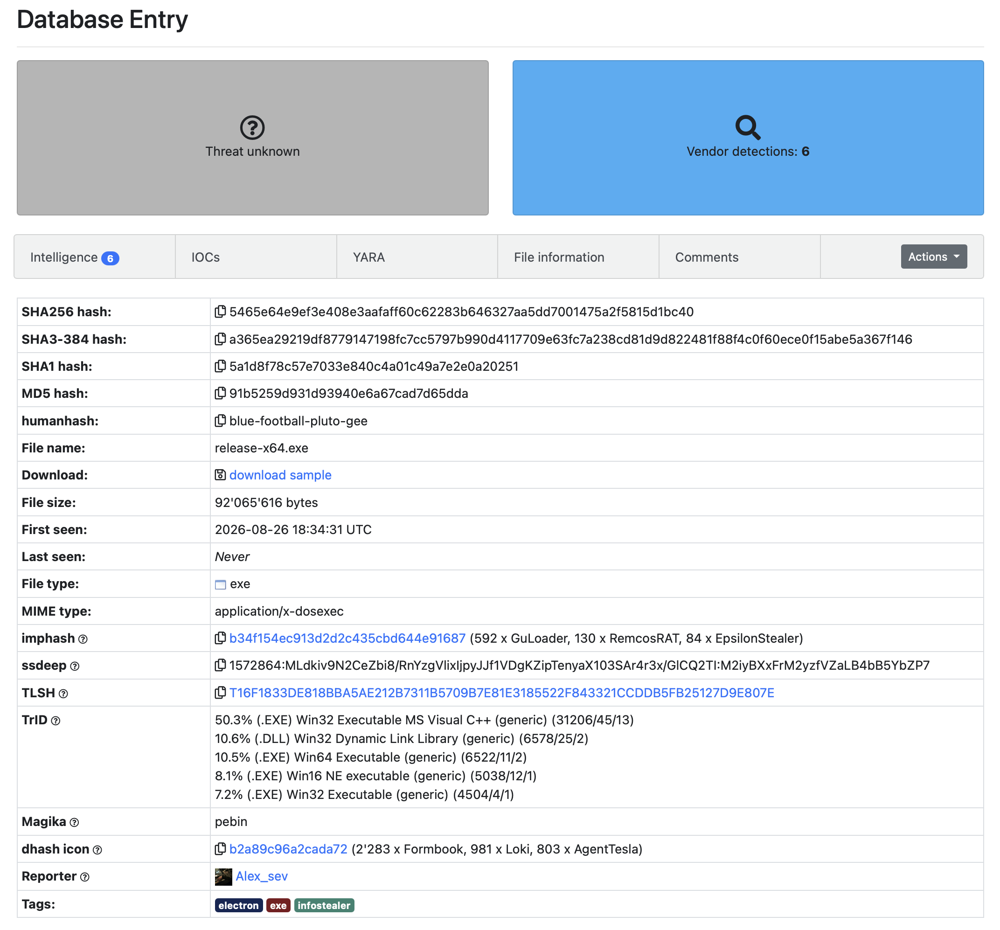

# Threat Intelligence Enrichment (IOC Analysis)

This document covers the threat-intelligence enrichment stage of the lab. Enrichment
is the analyst-desk skill of taking an artifact from an alert (a file hash, an IP, a
domain) and looking it up against public intelligence sources to answer a single
question: **is this known-bad, and what does it do?**

No malware was executed for this work. Every step below is a **read-only hash lookup**.
The sandbox behavior data referenced here was produced by the intelligence community,
not by this lab. That is the point of enrichment: the detonation has already been done
for you, and the analyst reads the results.

## Why this skill matters

On a live alert, an L1 does not re-run the malware. They pivot on an indicator and
consult reputation sources to decide the verdict and next action. This lab enriches two
contrasting file hashes to show **what a hash lookup can and cannot tell you**, and why
behavioral detection has to sit underneath it.

Sources used:

- **VirusTotal** (`virustotal.com`) - multi-engine hash reputation
- **MalwareBazaar** (`bazaar.abuse.ch`) - curated malware repository with sandbox data
- **AbuseIPDB** (`abuseipdb.com`) - IP reputation (for network IOCs)

---

## IOC 1: procdump64.exe (dual-use, clean hash)

| Field | Value |
|---|---|
| Artifact source | Step 4 (LSASS credential dumping detection) |
| SHA256 | `D1FC99AE304BD1D2BF28ABEB62531DA959E2431916194981B88C958FD713A8E6` |
| VirusTotal | **0 / 71** |
| Classification | Signed Microsoft Sysinternals tool (legitimate) |

<i>procdump returns a clean 0/71 on VirusTotal despite being the tool used to dump LSASS in Step 4.</i>

**Reading:** procdump is a legitimate, digitally signed Microsoft utility. Its hash is
clean on every engine. If the SOC relied on hash reputation alone, the LSASS dump in
Step 4 would have been **invisible**. This is a living-off-the-land (LOLBin) case: the
binary is trusted, so the malicious act is defined entirely by **behavior** (a
`0x1fffff` full-access open of `lsass.exe`), which is exactly what the Step 4 rule
detects. A clean hash does not mean the activity was benign.

---

## IOC 2: Fresh infostealer (Electron-packaged)

| Field | Value |
|---|---|
| Artifact source | MalwareBazaar recent feed (representative live sample) |
| SHA256 | `5465e64e9ef3e408e3aafaff60c62283b646327aa5dd7001475a2f5815d1bc40` |
| File name | `release-x64.exe` (~92 MB) |
| First seen | 2026-08-26 (hours old at time of lookup) |
| Tags | `electron`, `exe`, `infostealer` |
| VirusTotal | **5 / 74** |
| Sandbox verdicts | FileScan.IO Malicious (10/10), Kaspersky Malicious, Dr.Web Malware, Nucleon 86% Malware, Hatching Triage Malicious |

<i>A confirmed-malicious infostealer, first seen the same day, sits at only 5/74 on VirusTotal because signatures have not caught up yet.</i>

**Reading:** This is a current, real-world delivery technique. A stealer payload is
wrapped inside a ~92 MB **Electron** application (`release-x64.exe`), the same packaging
used by trojanized "fake app" campaigns (fake AI tools, fake meeting clients, cracked
software). MalwareBazaar only hosts confirmed malware, and five independent sandboxes
rate it Malicious, yet VirusTotal shows only 5 of 74 engines flagging it and the auto-classifier lists
the family as unknown. The reason is **detection lag**: the sample is hours old and most
engines have not written signatures for it. Over the coming days that ratio will climb.

**Financial-services relevance:** the `infostealer` tag, plus icon and import-hash
similarity that the intelligence flags to **AgentTesla, Formbook, LokiBot, and
EpsilonStealer**, identify this as a credential and session-data thief. Credential theft
is the primary threat to a lender, so this is a representative sample for a
financial-services SOC to track.

### Observed behaviors (from community sandboxes) mapped to ATT&CK

The sandbox reports (Hatching Triage, FileScan.IO, Dr.Web) recorded the following, all
of which map to techniques this lab already reasons about:

<i>Community sandbox behavior for the sample, including the Defender scan exclusion (T1562.001), WriteProcessMemory, and PowerShell execution.</i>

| Behavior observed | ATT&CK technique |
|---|---|
| Adds a Microsoft Defender scan exclusion | T1562.001 Impair Defenses: Disable or Modify Tools |
| Suspicious use of WriteProcessMemory | T1055 Process Injection |
| Enumerates running processes | T1057 Process Discovery |
| System language and storage enumeration | T1082 System Information Discovery |
| Executes PowerShell one-liner | T1059.001 Command and Scripting Interpreter: PowerShell |
| Executes VBScript via Windows Script Host | T1059.005 Command and Scripting Interpreter: Visual Basic |
| Looks up external IP via web service | T1016.001 Internet Connection Discovery |

Full-circle note: the **Defender exclusion (T1562.001)** is the same defense-evasion step
performed by hand in Step 4 to allow procdump to run. Real malware automates it to blind
the endpoint. Seeing an analyst action and an attacker action converge on the same
technique is a useful reminder that the technique, not the tool, is what the detection
should target.

---

## The core lesson: hash reputation is a lagging indicator

Putting the two IOCs side by side produces the takeaway of this stage:

| Sample | VT ratio | What the hash tells you | Why |
|---|---|---|---|
| procdump.exe | 0 / 71 | Nothing useful | Dual-use LOLBin. Trusted signed binary, malicious only by behavior. |
| Fresh infostealer | 5 / 74 | Understates the threat | Confirmed-bad, but hours old. Signatures lag on new samples. |
| Established commodity malware | ~55 / 70 | Convicts on its own | Mature sample, signatures fully propagated. |

Hash reputation is **blind** to living-off-the-land activity (procdump, 0/71) and **slow**
on fresh threats (infostealer, 5/74). It only becomes reliable once a sample is mature.
That is the entire justification for building **behavioral** detections (the `0x1fffff`
LSASS access mask, encoded-command parent/child chains, service-install persistence)
that fire regardless of whether a hash is known yet.

## Analyst takeaways

- Enrichment is a read-only desk skill performed on every alert, not an attack.
- A clean hash (0 detections) never clears an alert on its own. Judge the behavior.
- A low detection count on a **new** sample means signatures are lagging, not that the
  file is safe. Cross-check sandbox verdicts and first-seen date.
- Behavioral detection is the layer that covers the gap hash reputation leaves open.

## Sources

- procdump lookup: [VirusTotal - procdump hash](https://www.virustotal.com/gui/file/D1FC99AE304BD1D2BF28ABEB62531DA959E2431916194981B88C958FD713A8E6)
- Infostealer sample: [MalwareBazaar - 5465e64e...1bc40](https://bazaar.abuse.ch/sample/5465e64e9ef3e408e3aafaff60c62283b646327aa5dd7001475a2f5815d1bc40/)
- Infostealer lookup: [VirusTotal - infostealer hash](https://www.virustotal.com/gui/file/5465e64e9ef3e408e3aafaff60c62283b646327aa5dd7001475a2f5815d1bc40)
